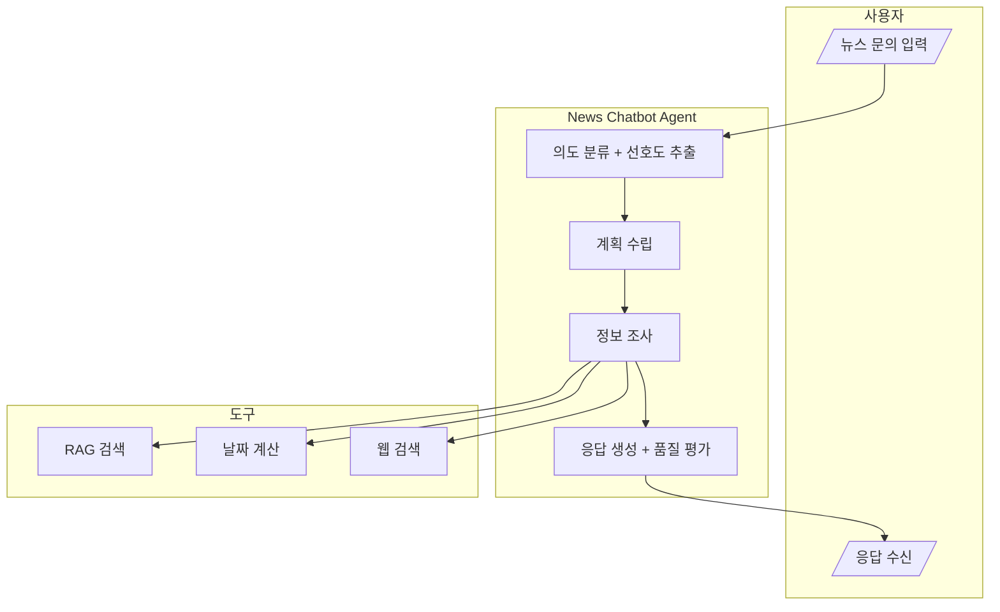
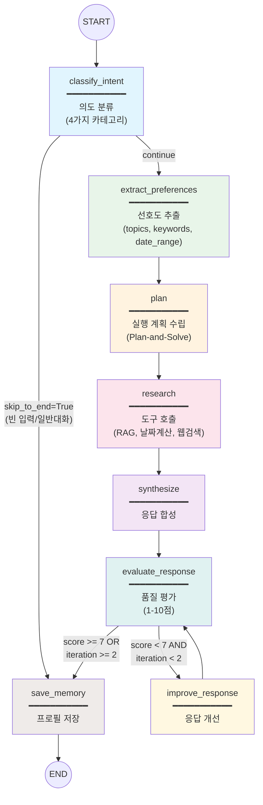
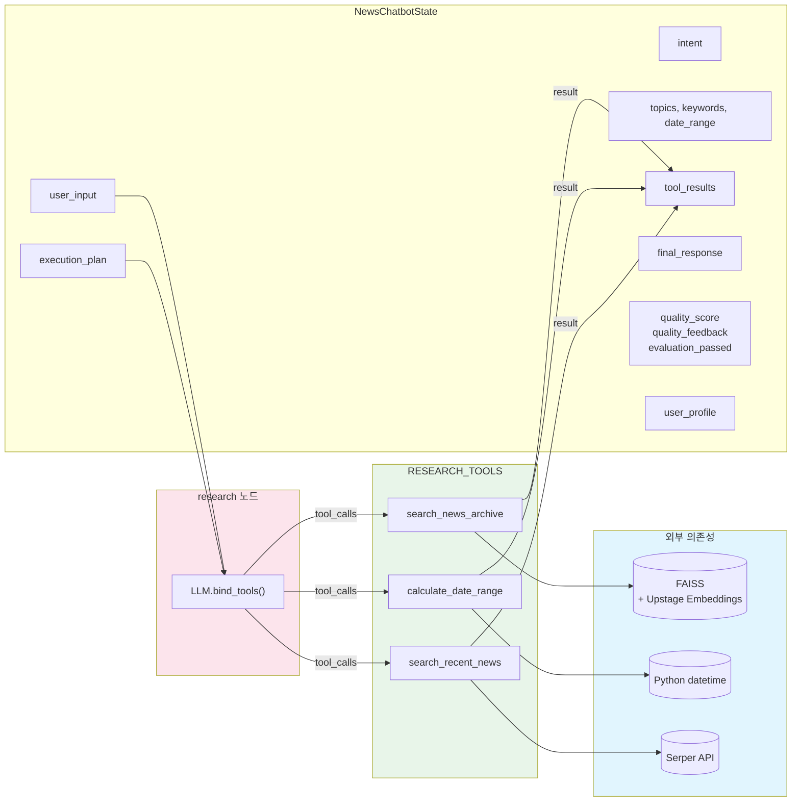

# Workflow Design Document: News Chatbot Agent

> 이 문서는 뉴스 챗봇 에이전트의 워크플로우 설계를 상세히 기술합니다.
> 실제 코드베이스(`agent/graph.py`, `agent/nodes.py`, `agent/tools.py`, `agent/state.py`, `agent/prompts.py`)를 기반으로 작성되었습니다.

---

## 1. 서비스 개요

### 1.1 핵심 목적과 페인 포인트

**핵심 목적**: AI 대화를 통해 사용자 맞춤형 뉴스 정보를 검색, 요약, 제공하는 에이전트 시스템

**해결하는 페인 포인트**:

| 페인 포인트 | 현재 문제 | 에이전트 솔루션 |
|------------|----------|----------------|
| **정보 과부하** | 뉴스 매체가 너무 많아 중요 정보 선별 어려움 | RAG 기반 뉴스 아카이브 검색 |
| **시간 부족** | 바쁜 일상에서 뉴스 소비 시간 확보 어려움 | 핵심 요약 제공 |
| **맥락 부족** | 상대적 날짜 표현 이해 어려움 ("지난주", "3일 전") | 날짜 계산 도구로 정확한 기간 파악 |
| **최신성 부족** | 저장된 정보만으로는 실시간 뉴스 파악 불가 | SERPER API로 실시간 뉴스 검색 |

### 1.2 주요 기능 요약

```
┌─────────────────────────────────────────────────────────────────┐
│                     News Chatbot Agent                           │
├─────────────────────────────────────────────────────────────────┤
│  1. 의도 분류 (Intent Classification)                            │
│     - 4가지 카테고리: 뉴스 검색, 트렌딩, 요약, 일반 대화         │
│                                                                  │
│  2. 선호도 추출 (Preference Extraction)                          │
│     - 대화에서 주제, 키워드, 날짜 범위 추출                      │
│                                                                  │
│  3. 계획 수립 (Plan-and-Solve)                                   │
│     - 사용자 요청 분석 후 실행 단계 도출                          │
│                                                                  │
│  4. 도구 호출 (Tool Execution)                                   │
│     - RAG 검색, 날짜 계산, 웹 검색                                │
│                                                                  │
│  5. 응답 합성 (Response Synthesis)                               │
│     - 수집된 정보를 종합하여 최종 응답 생성                       │
│                                                                  │
│  6. 품질 평가-개선 루프 (Evaluator-Optimizer)                    │
│     - 응답 품질 평가 (7점 이상 통과) + 최대 2회 반복 개선         │
│                                                                  │
│  7. 메모리 저장 (Memory Persistence)                             │
│     - 대화 체크포인트 (MemorySaver) + 사용자 프로필 (InMemoryStore) │
└─────────────────────────────────────────────────────────────────┘
```

### 1.3 설계 시 고민이 필요한 질문들

| 영역 | 질문 | 현재 구현 상태 |
|------|------|---------------|
| **데이터** | 뉴스 정보는 어디서 오는가? | 내부 지식베이스 (`NEWS_DATABASE`) + Serper 웹 검색 |
| **데이터** | 뉴스 데이터는 어떻게 관리되는가? | 10개 Mock 뉴스 (하드코딩) |
| **메모리** | 사용자 관심 주제는 어떻게 저장되는가? | `InMemoryStore` (기본 프로필 저장, 프로세스 재시작 시 휘발) |
| **메모리** | 대화 히스토리는 어떻게 유지되는가? | `MemorySaver` (LangGraph 체크포인트, thread_id 기반) |
| **품질** | 응답 품질은 어떻게 보장하는가? | Evaluator-Optimizer 루프 (7점 기준, 2회 반복) |
| **도구** | 웹 검색이 실패하면 어떻게 되는가? | 폴백 메시지 반환 ("API 키 미설정") |
| **도구** | RAG 검색이 실패하면 어떻게 되는가? | "관련 뉴스를 찾지 못했습니다" 메시지 |

---

## 2. 설계 도면

### 2.1 도면 #1: 사용자-시스템 상호작용 (기능 위주)



### 2.2 도면 #2: 워크플로우 흐름도 (Node/Edge 위주)



### 2.3 도면 #3: 도구 바인딩 및 데이터 흐름



---

## 3. 워크플로우 상세 설계

### 3.1 이용자 관점 흐름 (UX Flow)

**시나리오**: "최근 일주일간 엔비디아 관련 뉴스 알려줘"

```
┌─────────────────────────────────────────────────────────────────┐
│ [사용자 입력]                                                    │
│ "최근 일주일간 엔비디아 관련 뉴스 알려줘"                        │
└─────────────────────────────────────────────────────────────────┘
                              │
                              ▼
┌─────────────────────────────────────────────────────────────────┐
│ [에이전트 처리 - 사용자에게 보이지 않음]                         │
│                                                                  │
│ 1. 의도 분류: "news_search"                                     │
│ 2. 선호도 추출: topics=["엔비디아"], date_range=7 days          │
│ 3. 계획 수립: ["날짜 계산", "아카이브 검색", "웹 검색"]          │
│ 4. 도구 호출:                                                    │
│    - calculate_date_range(7, "days")                            │
│    - search_news_archive("엔비디아")                            │
│    - search_recent_news("엔비디아 뉴스")                        │
│ 5. 응답 합성: 뉴스 요약 작성                                     │
│ 6. 품질 평가: 8점 (통과)                                         │
│ 7. 메모리 저장: 관심 주제에 "엔비디아" 추가                      │
└─────────────────────────────────────────────────────────────────┘
                              │
                              ▼
┌─────────────────────────────────────────────────────────────────┐
│ [최종 응답]                                                      │
│                                                                  │
│ 📰 엔비디아 관련 뉴스 (최근 7일)                                 │
│                                                                  │
│ 🔹 **CES 2025: 엔비디아 신제품 발표** (2026-01-28)              │
│    - 차세대 GPU 아키텍처 공개                                    │
│    - AI 칩 시장 지배력 강화 전망                                 │
│                                                                  │
│ 🔹 **삼성전자-엔비디아 HBM 공급 계약** (2026-01-27)             │
│    - 차세대 메모리 공급 협력                                     │
│    - 반도체 동맹 강화                                            │
│                                                                  │
│ 🔹 **엔비디아 분기 실적 발표** (2026-01-25)                     │
│    - 매출 전년비 200% 성장                                       │
│    - AI 수요 폭발적 증가                                         │
│                                                                  │
│ 💡 검색 기간: 2026-01-26 ~ 2026-02-02                           │
└─────────────────────────────────────────────────────────────────┘
```

### 3.2 시스템 관점 흐름 (Technical Flow)

**State 변화 추적**:

```
┌─────────────────────────────────────────────────────────────────┐
│ 1. 초기 상태 (Initial State)                                    │
├─────────────────────────────────────────────────────────────────┤
│ state = {                                                        │
│   user_input: "최근 일주일간 엔비디아 관련 뉴스 알려줘"         │
│   messages: [],                                                  │
│   intent: "",              // 아직 분류 안 됨                   │
│   intent_confidence: 0.0,                                        │
│   topics: [],              // 추출 대기                         │
│   keywords: [],                                                  │
│   date_range: null,                                              │
│   execution_plan: "",      // 계획 대기                         │
│   tool_results: [],        // 도구 실행 결과 누적              │
│   final_response: "",                                            │
│   quality_score: 0,        // 평가 대기                         │
│   quality_feedback: "",                                          │
│   evaluation_passed: false,                                      │
│   iteration: 0,            // 개선 반복 횟수                    │
│   max_iterations: 2,       // 최대 개선 시도                    │
│   user_profile: {},                                              │
│   error_log: []                                                  │
│ }                                                                │
└─────────────────────────────────────────────────────────────────┘

┌─────────────────────────────────────────────────────────────────┐
│ 2. classify_intent 노드 실행 후                                 │
├─────────────────────────────────────────────────────────────────┤
│ state.intent = "news_search"        // LLM이 의도 분류          │
│ state.intent_confidence = 0.95      // 신뢰도 점수              │
│ state.messages += [HumanMessage]    // 대화 히스토리에 추가     │
└─────────────────────────────────────────────────────────────────┘

┌─────────────────────────────────────────────────────────────────┐
│ 3. extract_preferences 노드 실행 후                             │
├─────────────────────────────────────────────────────────────────┤
│ state.topics = ["엔비디아"]                                     │
│ state.keywords = ["뉴스", "최근"]                               │
│ state.date_range = {                                             │
│   time_value: 7,                                                 │
│   time_unit: "days"                                              │
│ }                                                                │
└─────────────────────────────────────────────────────────────────┘

┌─────────────────────────────────────────────────────────────────┐
│ 4. plan 노드 실행 후                                             │
├─────────────────────────────────────────────────────────────────┤
│ state.execution_plan = "                                         │
│   1. 날짜 범위 계산 (calculate_date_range 호출)                 │
│   2. 뉴스 아카이브 검색 (search_news_archive 호출)              │
│   3. 실시간 뉴스 검색 (search_recent_news 호출)                 │
│ "                                                                │
└─────────────────────────────────────────────────────────────────┘

┌─────────────────────────────────────────────────────────────────┐
│ 5. research 노드 실행 후 (도구 호출 결과)                       │
├─────────────────────────────────────────────────────────────────┤
│ state.tool_results = [                                           │
│   {                                                              │
│     tool: "calculate_date_range",                                │
│     result: "시작일: 2026-01-26, 종료일: 2026-02-02"            │
│   },                                                             │
│   {                                                              │
│     tool: "search_news_archive",                                 │
│     result: "[IT] 엔비디아 GPU 신제품 발표..."                  │
│   },                                                             │
│   {                                                              │
│     tool: "search_recent_news",                                  │
│     result: "엔비디아 CES 발표, 삼성 HBM 계약..."               │
│   }                                                              │
│ ]                                                                │
└─────────────────────────────────────────────────────────────────┘

┌─────────────────────────────────────────────────────────────────┐
│ 6. synthesize 노드 실행 후 (응답 생성)                          │
├─────────────────────────────────────────────────────────────────┤
│ state.final_response = "                                         │
│   📰 엔비디아 관련 뉴스 (최근 7일)                              │
│   🔹 CES 2025: 엔비디아 신제품 발표...                         │
│   🔹 삼성전자-엔비디아 HBM 공급 계약...                        │
│   ...                                                            │
│ "                                                                │
└─────────────────────────────────────────────────────────────────┘

┌─────────────────────────────────────────────────────────────────┐
│ 7. evaluate_response 노드 실행 후 (품질 평가)                   │
├─────────────────────────────────────────────────────────────────┤
│ state.quality_score = 8                 // 7점 이상 = 통과      │
│ state.quality_feedback = "구체적인 날짜와 내용 포함, 가독성 좋음"│
│ state.evaluation_passed = true          // 개선 루프 종료 조건  │
│ state.iteration = 1                     // 1회 평가 완료        │
└─────────────────────────────────────────────────────────────────┘

┌─────────────────────────────────────────────────────────────────┐
│ 8. save_memory 노드 실행 후 (프로필 업데이트)                   │
├─────────────────────────────────────────────────────────────────┤
│ state.user_profile = {                                           │
│   interests: ["엔비디아", "AI", "반도체"],  // 관심사 누적      │
│   query_history: [                           // 문의 이력 추가  │
│     {                                                            │
│       query: "최근 일주일간 엔비디아...",                       │
│       intent: "news_search",                                     │
│       quality_score: 8,                                          │
│       timestamp: 2026-02-02T...                                  │
│     }                                                            │
│   ]                                                              │
│ }                                                                │
│                                                                  │
│ // InMemoryStore에 user_id 기반으로 저장                        │
│ memory_store.put(namespace="user_profile", key=user_id, value=...) │
└─────────────────────────────────────────────────────────────────┘
```

### 3.3 노드별 상세 명세

| Node | 역할 | Input | Output | LLM 사용 | 구현 위치 |
|------|------|-------|--------|---------|----------|
| `classify_intent` | 사용자 문의를 4가지 카테고리로 분류 | `user_input` | `intent`, `intent_confidence`, `messages` | Yes (structured_output) | `nodes.py` |
| `extract_preferences` | 대화에서 뉴스 선호도 추출 | `messages` | `topics`, `keywords`, `date_range` | Yes (structured_output) | `nodes.py` |
| `plan` | Plan-and-Solve 기법으로 실행 계획 수립 | `user_input`, `intent`, `user_profile` | `execution_plan` | Yes (structured_output) | `nodes.py` |
| `research` | 계획에 따라 도구 호출 및 정보 수집 | `execution_plan`, `user_input` | `tool_results` | Yes (bind_tools) | `nodes.py` |
| `synthesize` | 수집된 정보를 종합하여 최종 응답 생성 | `user_input`, `tool_results` | `final_response`, `messages` | Yes | `nodes.py` |
| `evaluate_response` | 응답 품질 평가 (1-10점) | `user_input`, `final_response`, `intent` | `quality_score`, `quality_feedback`, `evaluation_passed`, `iteration` | Yes (structured_output) | `nodes.py` |
| `improve_response` | 피드백 반영하여 응답 개선 | `user_input`, `final_response`, `quality_feedback` | `final_response`, `messages` | Yes | `nodes.py` |
| `save_memory` | 사용자 프로필 및 이력 저장 | `user_input`, `intent`, `quality_score`, `topics` | `user_profile` | No | `nodes.py` |

**Conditional Edge 로직**:

| 조건 함수 | 분기점 | 조건 | 다음 노드 |
|----------|--------|------|----------|
| `classify_intent` 후 분기 | `intent="general"` (일반 대화) | - | `save_memory` |
| `classify_intent` 후 분기 | `intent!="general"` | - | `extract_preferences` |
| `should_improve_response` | `evaluation_passed=True` | - | `save_memory` (end) |
| `should_improve_response` | `iteration >= max_iterations` | - | `save_memory` (end) |
| `should_improve_response` | 그 외 | - | `improve_response` |

### 3.4 도구(Tool) 명세

| Tool | 목적 | Input Schema | Output | 실패 시 폴백 | 구현 위치 |
|------|------|-------------|--------|------------|----------|
| `search_news_archive` | 뉴스 아카이브 RAG 검색 | `query: str` | 관련 뉴스 기사 (최대 3개) | "관련 뉴스 없음" 메시지 | `tools.py` |
| `calculate_date_range` | 상대 날짜를 실제 날짜로 변환 | `time_value: int`, `time_unit: str` | 시작일, 종료일 | 오류 메시지 반환 | `tools.py` |
| `search_recent_news` | 실시간 뉴스 검색 (Serper API) | `query: str`, `num_results: int` | 검색 결과 요약 (최대 5개) | "API 키 미설정" 메시지 | `tools.py` |

**도구 의존성**:

```
search_news_archive
├── FAISS VectorStore
│   └── UpstageEmbeddings (solar-embedding-1-large)
└── NEWS_DATABASE (10개 Mock 뉴스)
    ├── IT: 엔비디아, 삼성전자, 애플
    ├── 경제: 금리, 환율
    └── 산업: 전기차, 배터리, 반도체

calculate_date_range
└── Python datetime + timedelta
    └── 지원 단위: days, weeks, months

search_recent_news
└── Serper API (SERPER_API_KEY 환경변수 필요)
    └── Google 뉴스 검색 결과 (5개)
```

---

## 4. 구현 전략

### 4.1 컨텍스트 엔지니어링

**State를 통한 노드 간 데이터 전달**:

```python
class NewsChatbotState(TypedDict):
    """뉴스 챗봇 에이전트 상태"""
    # 입력
    user_input: str                                      # 사용자 원본 입력
    messages: Annotated[List[BaseMessage], operator.add] # 대화 히스토리 (누적)

    # 의도 분류
    intent: str                                          # 분류된 의도
    intent_confidence: float                             # 분류 신뢰도

    # 뉴스 선호도
    topics: List[str]                                    # 관심 주제
    keywords: List[str]                                  # 검색 키워드
    date_range: Optional[dict]                           # 날짜 범위

    # 실행 계획
    execution_plan: str                                  # 실행 단계

    # 도구 결과
    tool_results: Annotated[List[dict], operator.add]    # 도구 호출 결과 (누적)

    # 최종 응답
    final_response: str                                  # 최종 응답 텍스트

    # 품질 평가
    quality_score: int                                   # 품질 점수 (1-10)
    quality_feedback: str                                # 평가 피드백
    evaluation_passed: bool                              # 통과 여부

    # 반복 제어
    iteration: int                                       # 현재 반복 횟수
    max_iterations: int                                  # 최대 반복 횟수 (기본: 2)

    # 메모리
    user_profile: dict                                   # 사용자 프로필 (관심사, 이력)
    error_log: Annotated[List[str], operator.add]        # 에러 로그 (누적)
```

**설계 포인트**:
- `operator.add`가 설정된 필드(`messages`, `tool_results`, `error_log`)는 누적됨
- 노드는 자신이 변경할 필드만 반환

### 4.2 메모리 구성

```
┌─────────────────────────────────────────────────────────────────┐
│                      기본 메모리 구성                             │
├─────────────────────────────────────────────────────────────────┤
│                                                                  │
│  ┌───────────────────────┐    ┌───────────────────────┐         │
│  │     MemorySaver       │    │    InMemoryStore      │         │
│  │  (LangGraph 필수)     │    │  (사용자 프로필)      │         │
│  ├───────────────────────┤    ├───────────────────────┤         │
│  │ Key: thread_id        │    │ Key: user_id          │         │
│  │ Scope: 대화 세션      │    │ Scope: 사용자 전체    │         │
│  │ 저장: 체크포인트      │    │ 저장: 프로필 데이터   │         │
│  │ 용도: 대화 연속성     │    │ 용도: 관심사 누적     │         │
│  │ 필수: LangGraph 요구  │    │ 수명: 프로세스 동안   │         │
│  └───────────────────────┘    └───────────────────────┘         │
│                                                                  │
│  [구현 현황]                                                     │
│  - MemorySaver: LangGraph 체크포인트 저장용 (기본 인프라)       │
│  - InMemoryStore: 간단한 사용자 프로필 저장 (interests, history)│
│  - 둘 다 인메모리, 프로세스 재시작 시 휘발                      │
│  - 실제 프로덕션에서는 Redis/PostgreSQL 등 영구 저장소 필요     │
│                                                                  │
│  [설계 의도]                                                     │
│  - 복잡한 메모리 아키텍처가 아닌 LangGraph의 기본 기능 활용     │
│  - 교육 목적으로 메모리 개념을 이해하기 위한 최소 구현          │
│                                                                  │
└─────────────────────────────────────────────────────────────────┘
```

**사용자 프로필 구조** (`user_profile`):

```
┌─────────────────────────────────────────────────────────────────┐
│ user_profile 데이터 구조                                         │
├─────────────────────────────────────────────────────────────────┤
│ {                                                                │
│   interests: [                                                   │
│     "엔비디아",                                                  │
│     "AI",                                                        │
│     "반도체"                                                     │
│   ],                                                             │
│   // 사용자가 관심을 보인 주제들 (중복 제거)                    │
│   // save_memory 노드에서 state.topics를 병합하여 누적          │
│                                                                  │
│   query_history: [                                               │
│     {                                                            │
│       query: "엔비디아 뉴스",         // 사용자 원본 입력        │
│       intent: "news_search",          // 분류된 의도             │
│       quality_score: 8,               // 최종 응답 품질 점수    │
│       timestamp: "2026-02-02T10:30:00" // 문의 시각             │
│     },                                                           │
│     ...                                // 과거 이력 계속 누적    │
│   ]                                                              │
│   // 문의 이력 리스트 (최대 N개까지 유지 가능)                  │
│ }                                                                │
└─────────────────────────────────────────────────────────────────┘

[활용 방안]
- interests: 다음 뉴스 추천 시 우선순위 반영
- query_history: 대화 맥락 파악, 반복 질문 감지
```

### 4.3 평가-최적화 루프 (Evaluator-Optimizer)

**평가 기준** (4가지):

| 기준 | 설명 |
|------|------|
| **정확성 (Accuracy)** | 뉴스 정보가 정확하고 신뢰할 수 있는가? |
| **관련성 (Relevance)** | 사용자 질문과 관련된 정보인가? |
| **완성도 (Completeness)** | 충분한 정보가 제공되었는가? |
| **가독성 (Readability)** | 읽기 쉽고 구조화되어 있는가? |

**점수 기준**:

| 점수 | 판정 | 액션 |
|------|------|------|
| 1-3점 | 응답 부적절 | 개선 필요 (improve_response) |
| 4-6점 | 개선 필요 | 개선 필요 (improve_response) |
| 7-8점 | 양호 | 통과 (save_memory) |
| 9-10점 | 우수 | 통과 (save_memory) |

**루프 제어 로직** (`should_improve_response`):

```
FUNCTION should_improve_response(state):
  ┌─────────────────────────────────────────────────────────────┐
  │ 조건부 분기 로직 (Conditional Edge)                         │
  ├─────────────────────────────────────────────────────────────┤
  │                                                              │
  │ IF state.evaluation_passed == true:                         │
  │   → RETURN "end"                                            │
  │   // 품질 기준 통과 시 즉시 종료                            │
  │   // save_memory 노드로 이동하여 결과 저장                  │
  │                                                              │
  │ ELSE IF state.iteration >= state.max_iterations:            │
  │   → RETURN "end"                                            │
  │   // 최대 반복 횟수 도달 (기본값: 2회)                      │
  │   // 더 이상 개선하지 않고 현재 응답으로 종료               │
  │                                                              │
  │ ELSE:                                                        │
  │   → RETURN "improve"                                        │
  │   // 품질 기준 미달 + 반복 여유 있음                        │
  │   // improve_response 노드로 이동하여 응답 개선             │
  │                                                              │
  └─────────────────────────────────────────────────────────────┘

[흐름 예시]
┌───────────────────────────────────────────────────────────────┐
│ Case 1: 1회 만에 통과                                         │
├───────────────────────────────────────────────────────────────┤
│ evaluate_response → quality_score=8, evaluation_passed=true   │
│ should_improve_response → "end" (즉시 종료)                   │
│ → save_memory → END                                           │
└───────────────────────────────────────────────────────────────┘

┌───────────────────────────────────────────────────────────────┐
│ Case 2: 1회 개선 후 통과                                      │
├───────────────────────────────────────────────────────────────┤
│ evaluate_response → quality_score=5, iteration=1              │
│ should_improve_response → "improve"                           │
│ → improve_response → 응답 개선                                │
│ → evaluate_response → quality_score=8, evaluation_passed=true │
│ should_improve_response → "end"                               │
│ → save_memory → END                                           │
└───────────────────────────────────────────────────────────────┘

┌───────────────────────────────────────────────────────────────┐
│ Case 3: 2회 개선해도 미달 (강제 종료)                         │
├───────────────────────────────────────────────────────────────┤
│ evaluate_response → quality_score=4, iteration=1              │
│ should_improve_response → "improve"                           │
│ → improve_response                                            │
│ → evaluate_response → quality_score=5, iteration=2            │
│ should_improve_response → "end" (max_iterations 도달)         │
│ → save_memory → END (점수 미달이지만 종료)                    │
└───────────────────────────────────────────────────────────────┘
```

---

## 5. 신뢰도 및 제약사항

### 5.1 구현 시 고민 사항

#### 비용 (Cost)

| 항목 | 호출 위치 | 호출 횟수 | 비용 요소 |
|------|----------|----------|----------|
| **LLM 호출** | classify_intent | 1회 | Solar Pro |
| **LLM 호출** | extract_preferences | 1회 | Solar Pro |
| **LLM 호출** | plan | 1회 | Solar Pro |
| **LLM 호출** | research | 1회 (도구 바인딩) | Solar Pro |
| **LLM 호출** | synthesize | 1회 | Solar Pro |
| **LLM 호출** | evaluate_response | 1~2회 (루프) | Solar Pro |
| **LLM 호출** | improve_response | 0~1회 (루프) | Solar Pro |
| **임베딩** | search_news_archive | 1회 (쿼리 임베딩) | Upstage Embedding |
| **API 호출** | search_recent_news | 0~1회 | Serper API |

**총 LLM 호출 횟수**: 최소 6회, 최대 8회 (2회 반복 시)

#### 지연 (Latency)

| 노드 | 예상 지연 | 병목 요소 |
|------|----------|----------|
| classify_intent | 0.5-1초 | LLM 호출 |
| extract_preferences | 0.5-1초 | LLM 호출 |
| plan | 1-2초 | LLM 호출 (구조화 출력) |
| research | 2-5초 | 다중 도구 호출, 웹 검색 |
| synthesize | 1-2초 | LLM 호출 (긴 텍스트) |
| evaluate_response | 0.5-1초 | LLM 호출 |
| improve_response | 1-2초 | LLM 호출 |

**총 응답 시간**: 약 6-13초 (1회 통과 시), 최대 18초 (2회 반복 시)

#### 환각 방지 (Hallucination)

| 전략 | 구현 방식 |
|------|----------|
| **RAG 기반 사실 검증** | 내부 뉴스 아카이브에서 검증된 정보 우선 사용 |
| **구조화된 출력** | Pydantic 모델로 LLM 출력 형식 제약 |
| **품질 평가 루프** | 생성된 응답을 별도 LLM이 평가 |
| **출처 명시** | 웹 검색 결과에 출처 포함 |

### 5.2 의도적 제외 기능 (Scope Limitation)

| 제외된 기능 | 제외 이유 |
|------------|----------|
| **실시간 뉴스 알림** | 푸시 알림 시스템 복잡성 |
| **뉴스 원문 전체 제공** | 저작권 이슈 |
| **뉴스 팩트체크** | 팩트체크 DB 연동 필요 |
| **뉴스 감성 분석** | 추가 모델 필요 (확장 활동으로 제공) |
| **다국어 지원** | 한국어 전용 |

### 5.3 알려진 제약사항

| 제약사항 | 영향 | 완화 방안 |
|---------|------|----------|
| **InMemoryStore 휘발성** | 프로세스 재시작 시 사용자 프로필 손실 | Redis/PostgreSQL로 교체 |
| **10개 Mock 뉴스 제한** | 지원되지 않는 주제 정보 부족 | 웹 검색으로 보완 |
| **Serper API 키 필요** | API 키 없으면 웹 검색 불가 | 내부 아카이브로 폴백 |
| **한국어 전용** | 다국어 지원 없음 | 프롬프트 다국어화 필요 |

---

## [Checklist] 최종 설계 점검

- [x] LLM 역할과 Tool 명확히 정의
  - LLM: 의도 분류, 선호도 추출, 계획 수립, 응답 합성, 품질 평가
  - Tools: RAG 검색, 날짜 계산, 웹 검색

- [x] 이용자/시스템 관점 흐름 구분
  - UX Flow: 입력 → 처리(비가시) → 응답
  - Technical Flow: State 변화 추적

- [x] 기능 위주 도면(#1) 포함
  - 사용자-Agent-LLM-Tools-Storage 관계도

- [x] 워크플로우 도면(#2) 포함
  - 8개 노드 흐름 + 조건부 분기

- [x] API 비용/Latency/Hallucination 대책
  - LLM 호출 횟수: 6-8회
  - 응답 시간: 6-18초
  - 환각 방지: RAG + 품질 평가 루프

- [x] 의도적 제외 기능 명시
  - 실시간 알림, 원문 제공, 팩트체크, 감성 분석

---

> **문서 버전**: 1.0
> **최종 수정**: 2026-02-02
> **작성 기준 코드**: `news_chatbot_agent/agent/*.py`
