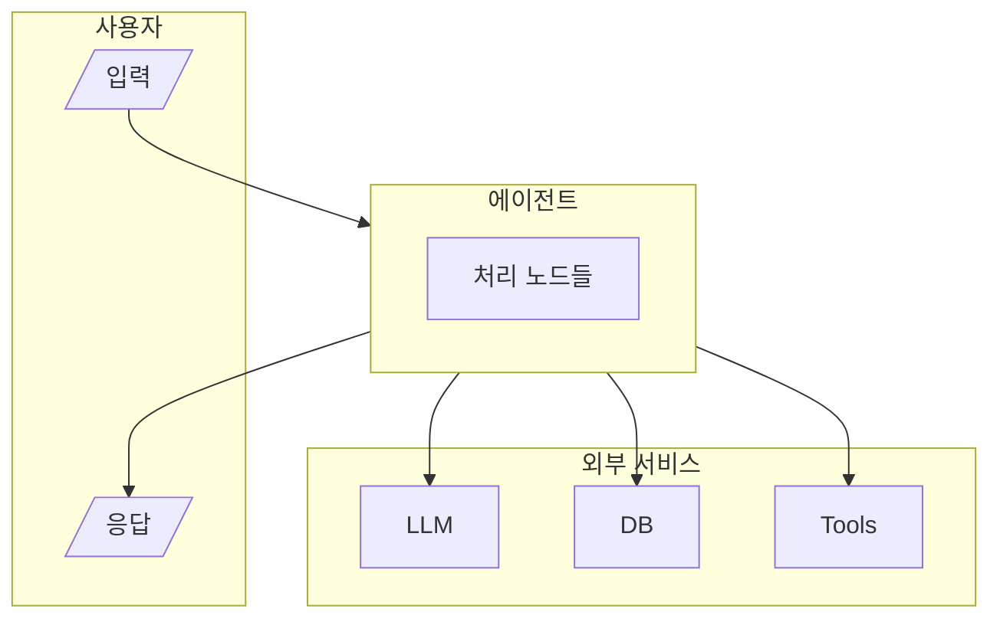
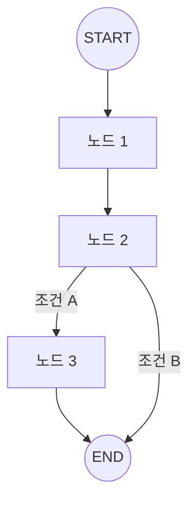

# Workflow Design Document 작성 가이드

> AI 에이전트 워크플로우 설계 문서 작성을 위한 간단한 가이드

---

## 문서 구조

```
1. 서비스 개요
   ├── 1.1 핵심 목적과 페인 포인트
   ├── 1.2 주요 기능 요약
   └── 1.3 설계 시 고민이 필요한 질문들

2. 설계 도면
   ├── 2.1 도면 #1: 기능 위주 (사용자-시스템-LLM-DB-도구)
   ├── 2.2 도면 #2: 워크플로우 위주 (Node/Edge)
   └── 2.3 도면 #3: 데이터 흐름 (선택)

3. 워크플로우 상세 설계
   ├── 3.1 이용자 관점 흐름 (UX Flow)
   ├── 3.2 시스템 관점 흐름 (Technical Flow)
   ├── 3.3 노드별 상세 명세
   └── 3.4 도구(Tool) 명세

4. 구현 전략
   ├── 4.1 컨텍스트 엔지니어링
   ├── 4.2 메모리 관리 전략
   └── 4.3 품질 보장 전략

5. 신뢰도 및 제약사항
   ├── 5.1 구현 시 고민 사항 (비용/지연/환각)
   ├── 5.2 의도적 제외 기능
   └── 5.3 알려진 제약사항
```

---

## 섹션별 작성 가이드

### 1. 서비스 개요

**1.1 핵심 목적과 페인 포인트**

| 페인 포인트 | 현재 문제 | 에이전트 솔루션 |
|------------|----------|----------------|
| [문제 1] | [기존 방식의 한계] | [AI가 해결하는 방법] |
| [문제 2] | ... | ... |

**1.2 주요 기능 요약**
- 핵심 기능 3-5개를 간략히 나열

**1.3 설계 시 고민이 필요한 질문들**

| 영역 | 질문 | 현재 구현 상태 |
|------|------|---------------|
| 데이터 | 정보는 어디서 오는가? | [답변] |
| 메모리 | 상태는 어떻게 저장되는가? | [답변] |
| 품질 | 응답 품질은 어떻게 보장하는가? | [답변] |

---

### 2. 설계 도면

**도면 #1: 기능 위주** - 시스템 구성 요소 간 관계



**도면 #2: 워크플로우 위주** - Node/Edge 흐름



---

### 3. 워크플로우 상세 설계

**3.1 이용자 관점 흐름 (UX Flow)**

```
[사용자 입력] → [처리 (비가시)] → [최종 응답]

예시:
"최근 일주일간 엔비디아 뉴스 알려줘" → [Agent 처리] → "📰 엔비디아 뉴스 요약..."
```

**3.2 시스템 관점 흐름 (Technical Flow)**

```python
# State 변화 추적
state["input"] = "사용자 입력"
# → 노드 1 처리 후
state["field_1"] = "처리 결과"
# → 노드 2 처리 후
state["field_2"] = "처리 결과"
# → 최종 출력
state["output"] = "최종 응답"
```

**3.3 노드별 상세 명세**

| Node | 역할 | Input | Output | LLM 사용 |
|------|------|-------|--------|---------|
| node_1 | [역할] | [입력 필드] | [출력 필드] | Yes/No |
| node_2 | ... | ... | ... | ... |

**3.4 도구(Tool) 명세**

| Tool | 목적 | Input | Output | 실패 시 폴백 |
|------|------|-------|--------|-------------|
| tool_1 | [목적] | [파라미터] | [반환값] | [폴백 전략] |

---

### 4. 구현 전략

**4.1 컨텍스트 엔지니어링**
- State 구조 정의 (TypedDict)
- 노드 간 데이터 전달 방식

**4.2 메모리 관리 전략**
- 단기 메모리: [방식] (예: MemorySaver)
- 장기 메모리: [방식] (예: InMemoryStore, Redis, PostgreSQL)

**4.3 품질 보장 전략**
- 평가 기준: [기준들]
- 통과 조건: [조건]
- 재시도 로직: [최대 N회]

---

### 5. 신뢰도 및 제약사항

**5.1 구현 시 고민 사항**

| 항목 | 고려사항 |
|------|---------|
| 비용 | LLM 호출 횟수, API 비용 |
| 지연 | 노드별 예상 지연, 병목 지점 |
| 환각 | RAG, 출처 명시, 품질 평가 |

**5.2 의도적 제외 기능**

| 제외된 기능 | 제외 이유 |
|------------|----------|
| [기능] | [이유] |

**5.3 알려진 제약사항**

| 제약사항 | 영향 | 완화 방안 |
|---------|------|----------|
| [제약] | [영향] | [방안] |

---

## 최종 체크리스트

- [ ] LLM의 역할과 Tool이 명확히 정의되었는가?
- [ ] 이용자 관점과 시스템 관점 흐름이 구분되어 있는가?
- [ ] 기능 위주 도면(#1)이 포함되었는가?
- [ ] 워크플로우 도면(#2)이 포함되었는가?
- [ ] 비용/지연/환각 대책이 명시되었는가?
- [ ] 의도적 제외 기능이 명시되었는가?

---

## 참고 예시

- [WORKFLOW_DESIGN.md](./WORKFLOW_DESIGN.md) - News Chatbot Agent 설계 문서
